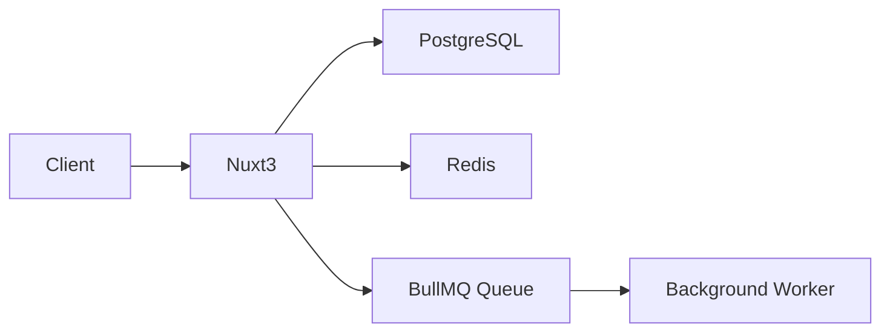

# Technology Stack — Selection & Standards

> This rule defines the **approved tech stack** for all projects. When starting a new project or proposing a new dependency, follow the decision criteria below.

---

## 🗂️ Quick Reference — Approved Stack

| Layer | Primary Choice | Alternative | Avoid |
|-------|---------------|-------------|-------|
| **Frontend — Landing/SEO** | Nuxt 3+ | — | CRA/Vue CLI (deprecated) |
| **Frontend — Admin/Dashboard** | Vue 3 + Vite (SPA) | — | Nuxt (overkill for internal admin) |
| **UI Components** | Nuxt UI / shadcn-vue | Vuetify | Quasar (too heavy) |
| **Styling** | Tailwind CSS | CSS Modules | Styled-components (runtime cost) |
| **State Management** | Pinia | Vuex (deprecated) | MobX, Recoil |
| **Data Fetching** | useFetch / useAsyncData | Vue Query | Axios alone |
| **Backend Framework** | Express.js + Node | Fastify | Hapi, Koa |
| **API Style** | REST (default) | tRPC (fullstack TS) | GraphQL (unless needed) |
| **Language** | TypeScript (always) | — | Plain JavaScript |
| **Database** | PostgreSQL | — | MySQL (prefer PG) |
| **ORM** | Prisma | Drizzle | Sequelize, TypeORM |
| **Cache** | Redis (ioredis) | Upstash Redis | Memcached |
| **Queue — Simple jobs** | BullMQ (Redis-backed) | — | — |
| **Queue — Enterprise/Microservices** | RabbitMQ | Kafka (high-throughput streams) | — |
| **Auth** | NuxtAuth (Sidebase) / JWT+bcrypt (API) | Lucia Auth | Firebase Auth |
| **File Storage** | AWS S3 / Cloudflare R2 | Supabase Storage | Local disk (not scalable) |
| **Email** | Resend | Nodemailer + SMTP | SendGrid (expensive) |
| **Search** | PostgreSQL FTS (start here) | Meilisearch | Elasticsearch (unless needed) |
| **Monitoring** | Grafana + Prometheus | Datadog | — |
| **Logging** | Pino | Winston | console.log (production) |
| **Testing** | Vitest + Testing Library | Jest | Mocha |
| **E2E Testing** | Playwright | Cypress | Selenium |
| **CI/CD** | GitHub Actions | — | Jenkins (legacy) |
| **Containerization** | Docker + Docker Compose | — | — |
| **Deployment** | Vercel (frontend) + Railway/Fly.io (backend) | AWS | — |
| **API Docs** | Swagger / OpenAPI 3.0 | — | Postman collections only |

---

## 🖥️ Frontend — Chọn đúng framework

### Decision Table

| Tiêu chí | Nuxt 3 | Vue 3 + Vite (SPA) |
|----------|------------------------|--------------------|
| **Mục đích** | Landing page, marketing, blog | Admin panel, dashboard, internal tool |
| **SEO** | ✅ Universal Rendering — Google index tốt | ❌ SPA — khó SEO |
| **Lưu trữ** | Vercel (tối ưu nhất) hoặc Node Server | Cloudflare Pages, Netlify, S3 |
| **Performance** | Hybrid Rendering — tối ưu hiển thị nhanh | Client-side rendering |
| **Auth** | NuxtAuth (Sidebase) | JWT stored in cookie/localStorage |
| **API** | Nuxt Server API / Nitro | Gọi backend REST riêng biệt |
| **Build complexity** | Cao hơn | Đơn giản hơn |

> **Rule**: Một project thường có **cả hai** — Nuxt 3 cho public site + Vue 3 cho admin.

---

### Nuxt 3 — Landing Page / SEO Project

```bash
npx nuxi@latest init my-landing
```

**Tại sao Nuxt 3 cho landing page:**
- Universal Rendering (SSR) → Google crawl được nội dung
- Tích hợp sẵn Auto-imports (components, composables) 
- Image optimization tự động (`@nuxt/image`)
- `<head>` metadata bằng hàm `useSeoMeta` cực kì dễ dàng
- Route Rules cho phép cache API (SWR) linh hoạt

```ts
// app.vue hoặc các trang — SEO metadata
useSeoMeta({
  title: 'My App',
  description: 'Mô tả trang chính',
  ogSiteName: 'My App',
  ogImage: 'https://myapp.com/image.png'
})
```

**Folder structure (Nuxt 3)**
```
src/
├── components/           # Auto-imported components
├── layouts/              # Default, Auth layouts
├── pages/                # File-based routing
│   ├── index.vue         # Homepage
│   ├── about.vue
│   ├── blog/
│   │   ├── index.vue     # Blog list
│   │   └── [slug].vue    # Blog post
│   └── pricing.vue
├── server/
│   └── api/              # Nitro API Routes
└── app.vue
```

---

### Vue 3 + Vite — Admin / Dashboard Project

```bash
npm create vite@latest my-admin -- --template vue-ts
cd my-admin && npm install
```

**Tại sao Vue SPA cho admin:**
- Admin panel không cần SEO (đăng nhập mới vào được)
- SPA build đơn giản, deploy lên S3/Cloudflare Pages/Nginx
- Dùng Composition API + Pinia để quản lý state phức tạp cực kỳ dễ dàng
- Tốc độ rebuild và hot reload bằng Vite chớp nhoáng

**Folder structure (Vite Vue SPA)**
```
src/
├── router/              # Vue Router
├── views/               # Các trang chính
│   ├── Dashboard.vue
│   ├── Users/
│   │   ├── UserList.vue
│   │   └── UserDetail.vue
│   └── Settings.vue
├── components/
│   ├── layout/          # Sidebar, Header, Layout
│   └── ui/              # Shared UI components
├── stores/              # Pinia state management
│   └── users.ts
├── composables/         # Vue composables (useFetch, useAuth)
├── lib/                 # axios instance, utils
└── main.ts
```

**Key Rules cho Admin:**
- Protected routes với Vue Router meta fields (`requiresAuth: true`)
- Role-based UI: Custom directive `v-permission` để ẩn/hiện element
- Token refresh tự động trong axios interceptor


---

## 🗄️ Database — PostgreSQL + Prisma

### Why PostgreSQL
- ACID compliant, battle-tested
- Excellent JSON support (`jsonb`) — avoids needing MongoDB in most cases
- Full-text search built-in
- Row-level security for multi-tenant apps
- Best ORM support (Prisma, Drizzle)

### Prisma Setup
```bash
npm install prisma @prisma/client
npx prisma init --datasource-provider postgresql
```

### Prisma Schema Conventions
```prisma
// prisma/schema.prisma

model User {
  id        String   @id @default(cuid())   // ✅ cuid() for distributed systems
  email     String   @unique
  name      String?
  role      Role     @default(USER)
  createdAt DateTime @default(now())
  updatedAt DateTime @updatedAt
  deletedAt DateTime?                        // soft delete

  orders    Order[]

  @@map("users")                             // ✅ snake_case table name
  @@index([email])
}

enum Role {
  USER
  ADMIN
}
```

### Prisma Client — Singleton Pattern
```ts
// src/lib/db.ts
import { PrismaClient } from '@prisma/client';

const globalForPrisma = global as unknown as { prisma: PrismaClient };

export const db =
  globalForPrisma.prisma ||
  new PrismaClient({
    log: process.env.NODE_ENV === 'development' ? ['query', 'error'] : ['error'],
  });

if (process.env.NODE_ENV !== 'production') globalForPrisma.prisma = db;
```

### Migration Workflow
```bash
# Development: auto-migrate
npx prisma migrate dev --name add_user_role

# Production: apply pending migrations
npx prisma migrate deploy

# View DB in browser
npx prisma studio
```

### PostgreSQL Best Practices
- Use `cuid()` or `uuid()` for primary keys (not auto-increment integers for distributed systems)
- Always add `@@index` on foreign keys and frequently queried columns
- Use `jsonb` columns for flexible/schema-less data instead of adding MongoDB
- Enable `pg_trgm` extension for fuzzy search
- Set `statement_timeout` and `lock_timeout` for long queries

---

## ⚡ Cache — Redis + ioredis

### Why Redis
- Sub-millisecond latency
- Supports strings, hashes, lists, sets, sorted sets, streams
- Built-in TTL, pub/sub, Lua scripts
- Powers caching + queues (BullMQ) + rate limiting + sessions

### Redis Client Setup
```ts
// src/lib/redis.ts
import Redis from 'ioredis';

const globalForRedis = global as unknown as { redis: Redis };

export const redis =
  globalForRedis.redis ||
  new Redis(process.env.REDIS_URL!, {
    maxRetriesPerRequest: 3,
    enableReadyCheck: true,
    lazyConnect: true,
  });

if (process.env.NODE_ENV !== 'production') globalForRedis.redis = redis;
```

### Cache Helper
```ts
// src/lib/cache.ts
import { redis } from './redis';

export async function getOrSet<T>(
  key: string,
  fetcher: () => Promise<T>,
  ttlSeconds = 3600
): Promise<T> {
  const cached = await redis.get(key);
  if (cached) return JSON.parse(cached);

  const data = await fetcher();
  await redis.setex(key, ttlSeconds, JSON.stringify(data));
  return data;
}

export async function invalidate(pattern: string) {
  const keys = await redis.keys(pattern);
  if (keys.length) await redis.del(...keys);
}
```

### Redis Key Naming → See `naming-conventions.md`
```
myapp:v1:user:123:profile    (TTL: 1h)
myapp:v1:session:abc123      (TTL: 7d)
myapp:v1:rate_limit:ip:...   (TTL: 15m)
```

### Queue with BullMQ (Simple — default)
```ts
// src/queues/email-queue.ts
import { Queue, Worker } from 'bullmq';
import { redis } from '@/lib/redis';

export const emailQueue = new Queue('email', { connection: redis });
await emailQueue.add('send-welcome', { to: user.email, name: user.name });
```

---

## 📨 Queue — Chọn đúng loại

### Decision Table

| Tiêu chí | BullMQ | RabbitMQ | Kafka |
|----------|--------|----------|-------|
| **Khi dùng** | Jobs đơn giản, retry, schedule | Microservices, routing phức tạp | Event streaming, log, billions messages |
| **Throughput** | Trung bình | Cao | Cực cao (triệu msg/s) |
| **Persistence** | Redis TTL | Disk (durable) | Disk (log-based, immutable) |
| **Setup** | Redis có sẵn | Cài thêm RabbitMQ | Cài thêm Kafka + Zookeeper |
| **Retry** | ✅ Built-in | ✅ Dead Letter Queue | ✅ Consumer offset |
| **Ordering** | ❌ Không đảm bảo | ✅ Per-queue | ✅ Per-partition |
| **Replay** | ❌ | ❌ | ✅ Có thể replay |
| **Độ phức tạp** | Thấp | Trung bình | Cao |

> **Rule**: Mặc định dùng **BullMQ**. Chỉ dùng RabbitMQ khi microservices. Chỉ dùng Kafka khi cần stream lớn hoặc replay.

### BullMQ — Default (Redis-backed)
```ts
// Khi nào: email, notification, PDF, image resize, scheduled tasks
const emailQueue = new Queue('email', {
  connection: redis,
  defaultJobOptions: { attempts: 3, backoff: { type: 'exponential', delay: 2000 } },
});
```

### RabbitMQ — Microservices
```ts
// Khi nào: nhiều service cần nhận cùng 1 message (pub/sub), routing phức tạp
import amqplib from 'amqplib';

const conn = await amqplib.connect(process.env.RABBITMQ_URL!);
const channel = await conn.createChannel();

// Exchange-based routing
await channel.assertExchange('order.events', 'topic', { durable: true });
await channel.publish('order.events', 'order.placed', Buffer.from(JSON.stringify(payload)));

// Consumer
await channel.assertQueue('email-service.order.placed', { durable: true });
await channel.bindQueue('email-service.order.placed', 'order.events', 'order.placed');
channel.consume('email-service.order.placed', async (msg) => {
  if (!msg) return;
  const data = JSON.parse(msg.content.toString());
  await sendOrderEmail(data);
  channel.ack(msg);
});
```

### Kafka — High-throughput Streaming
```ts
// Khi nào: analytics events, audit logs, real-time feeds, > 100k msg/s
import { Kafka } from 'kafkajs';

const kafka = new Kafka({ brokers: [process.env.KAFKA_BROKER!] });

// Producer
const producer = kafka.producer();
await producer.send({
  topic: 'user-events',
  messages: [{ key: userId, value: JSON.stringify({ event: 'page_viewed', page: '/checkout' }) }],
});

// Consumer group
const consumer = kafka.consumer({ groupId: 'analytics-service' });
await consumer.subscribe({ topic: 'user-events', fromBeginning: false });
await consumer.run({
  eachMessage: async ({ message }) => {
    await analyticsService.track(JSON.parse(message.value!.toString()));
  },
});
```

### Queue Naming → See `naming-conventions.md`
```
BullMQ queue names: myapp.email.send
RabbitMQ exchange:  order.events  (type: topic)
RabbitMQ queue:     email-service.order.placed
Kafka topic:        user-events, order-events, payment-events
```


## 📄 Documentation

### API Documentation — OpenAPI / Swagger
```bash
npm install swagger-ui-express @asteasolutions/zod-to-openapi
```

- Every API endpoint MUST have OpenAPI annotations
- Auto-generate from code (Zod schemas or JSDoc)
- Mount at `/api-docs`
- Keep `openapi.yaml` committed to repo

### Code Documentation
```ts
/**
 * Find a user by their email address.
 * @param email - The user's email (must be lowercase)
 * @returns The user object or null if not found
 * @throws {AppError} If database is unavailable
 */
async function findUserByEmail(email: string): Promise<User | null> {}
```

### README Template (mandatory for every service)
```markdown
# Service Name

## What it does (1-2 sentences)

## Tech Stack
- Runtime: Node.js 20 + TypeScript
- Framework: Nuxt 3
- Database: PostgreSQL (Prisma)
- Cache: Redis

## Quick Start
\`\`\`bash
cp .env.example .env
npm install
npx prisma migrate dev
npm run dev
\`\`\`

## Environment Variables → see .env.example
## API Documentation → /api-docs
## Architecture → docs/architecture.md
```

### Architecture Diagrams (docs/architecture/)
- Use **Mermaid** for all diagrams (version-controlled, no external tools)
- Required diagrams: System context, Component diagram, Data flow, DB ERD



---

## ✅ Technology Decision Process

When **proposing a new library or technology**, evaluate against these criteria:

| Criterion | Questions to ask |
|-----------|-----------------|
| **Necessity** | Does an approved alternative already solve this? |
| **Maintenance** | Stars > 1k? Last commit < 6 months? |
| **Bundle size** | Check bundlephobia.com — is it worth the KB? |
| **TypeScript** | Does it have native TS types? |
| **License** | Is it MIT/Apache? (No GPL in commercial products) |
| **Security** | `npm audit` — zero high/critical vulnerabilities |
| **Community** | Active issues/discussions? Stack Overflow answers? |

### Decision Template
```markdown
## Technology Decision: [Library Name]

**Problem**: What problem does this solve?
**Alternative evaluated**: What from the approved stack was considered?
**Why chosen**: Specific reason this is better for the use case
**Risk**: Known downsides or migration cost
**Decision**: ✅ Adopt / ❌ Reject
```
